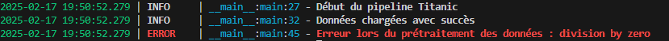

# TP : Python production code
## NOM Prénom : KOUMBA BOUNDA Louis-Marie 

Ce TP permet d'appliquer les notions de dev pour la mise en place d'une solution ML prête à etre mise en production. Il utilse le dataset [Titanic](https://www.kaggle.com/competitions/titanic/data?select=train.csv). 

Le début du TP commencera par la présentation rapide du IDE VScoduim.

Amusez-vous Bien 😎

## Environnement virtuel

1.  Créez un environnement virtuel pour le projet avec le module venv et activez le.

C'est ce j'ai fait dans le terminal alors avec `python -m venv mon_env`, puis travaillant sous windows j'ai donc éxecuté : `.\mon_env\scripts\activate`.

2.  Lisez depuis les packages utilisées dans le notebook, créez une liste des packages requis dans un fichier "requirements.txt"
    1.  1.  Installer ces packages avec le gestionnaire pip
        2.  Spécifiez les versions de packages dans le requirments.txt. utilisez la commande "pip freeze"
    
De la même manière, j'ai écris sur le terminal la commande : `pip install -r .\requirements.txt`, enfin avec `pip freeze` j'ai pu observer les différentes versions de packages.

## Notebook

A faire pour les deux Notebook.

1.  Utilisez le notebook depuis VScoduim en choisissant l'interpréteur python dans l'environnement virtuel.
2.  Complétez les cellules manquantes dans l'étude.

Ici j'ai directement la version corrigé du notebook 02 et c'est le celui sur lequel le TP a été réalisé.

## Programmation modulaire

1.  Transformer les notebook en fichier python. Utilisez Vscodium directement sans faire copier coller des cellules

Sur VS code j'ai donc bien fait `Import Notebook to script` ce qui a permis d'avoir un fichier python (qui est plus tard les deux fichiers **DataManager.py** et **Prediction.py** du dossier **processing**).

2.  Modifier le code en écrivant en fonction les différents parties du code.

Pour plus de lisibilité, j'ai séparer le fichier en deux comme dit précedemment : **DataManager.py** et **Prediction.py**

3.  Proposez une structure (arborescence) du projet pour une programmation modulaire.
    - Utilisez cet outils en ligne : [Drawio](https://app.diagrams.net)
4.  Ecrivez sous forme de module tout le projet
    1.  N'oubliez pas de mettre de fonction (main) train.py et predict.py

## Règles du code

1.  Utilisez le typing des des fonctions en mettant les inputs, outputs souhaités et espérés.
2.  Ajoutez la docstring pour les fonctions avec le l'extension autodocstring de VScoduim
3.  Remplacez les prints par des logs en utilisant le package [loguru](/C:/Users/AliHARCH/AppData/Local/Programs/Joplin/resources/app.asar/%5Bhttps:/github.com/Delgan/loguru "%5Bhttps://github.com/Delgan/loguru")
4.  Ajoutez la gestion des erreurs dans le code (try except & finally)
5.  Appliquez ce [linter](https://marketplace.visualstudio.com/items?itemName=charliermarsh.ruff) pour améliorer la vibilité et la lecture du code
6.  Profilez le code avec les deux module [line_profiler](https://github.com/pyutils/line_profiler) et [memory_profiler.](https://github.com/pythonprofilers/memory_profiler)

## Débogage

1.  Simulez une erreur dans le code et utilisez le débugger python de Vscoduim pour la trouvez (capture d'écran pour le rendu)

 Grace au débugger on a pu voir que l'erreur venait du fait qu'on a défini oui=10/0 sur le fichier `DataManager.py` sur la fonction **replace_nan **

## Bonus

Vous avez remarquez que lorsqu'on utilise un nouveau module il faudrait à chaque fois revenir sur le fichier des requirementes et le rajouter en mettant en place sa version exacte.

Il y'a un risque d'oublie, d'incompatibilité avec les versions de dépendances. ça serai bien si on avait un gestionnaire de projet python qui permettrai de :

- Ajoutez automatiquement un package au fichier des prérequis une fois installer.
- Qui remplace à la fois le mudule venv et pip.
- Séparer les prérequis utilisez lors du dev (profiler) et ceux dans la prod
- Générer une srtucture de fichier pour un nouveau projet
- ... etc

Cette outil s'appelle [UV](https://github.com/astral-sh/uv)

&nbsp;

&nbsp;